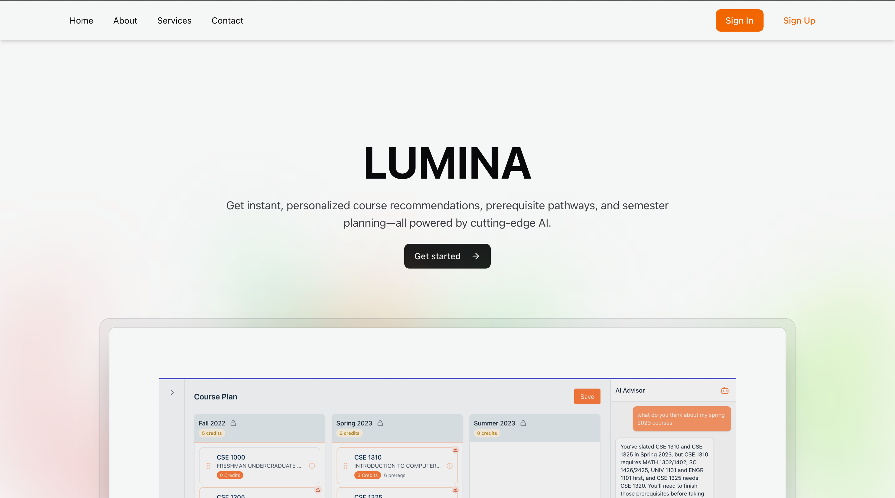
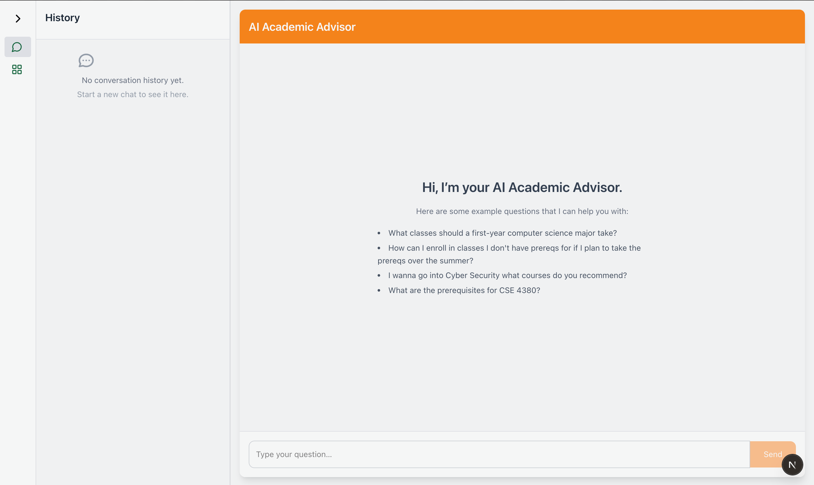
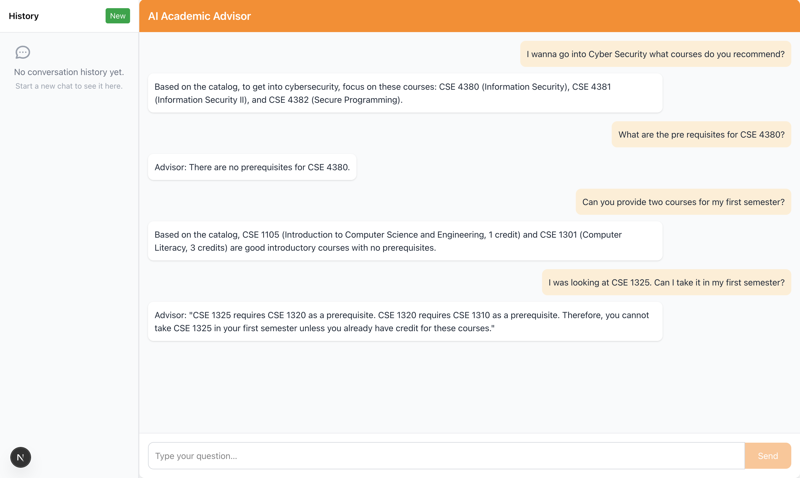
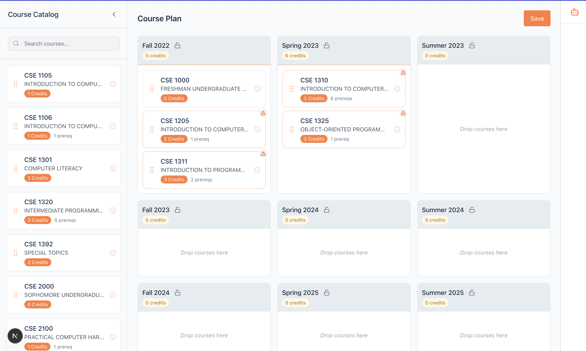
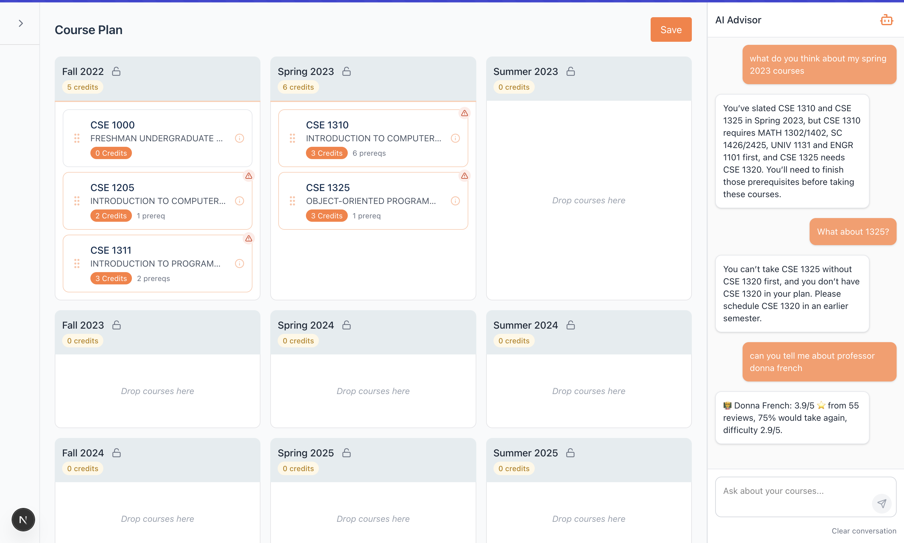
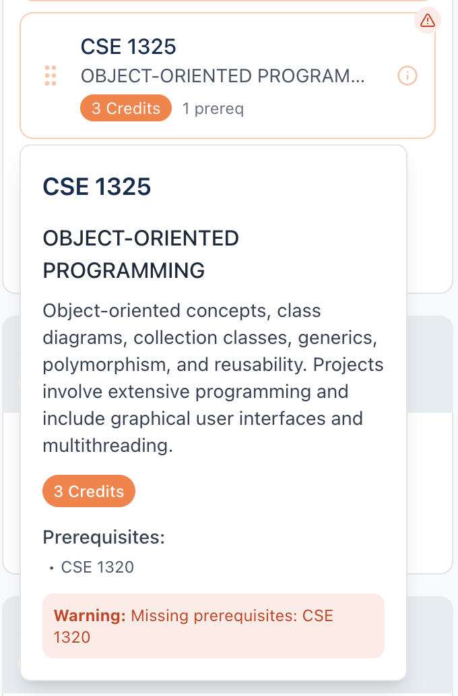

This is a [Next.js](https://nextjs.org) project bootstrapped with [`create-next-app`](https://nextjs.org/docs/app/api-reference/cli/create-next-app).

## Getting Started

First, run the development server:

```bash
npm run dev
# or
yarn dev
# or
pnpm dev
# or
bun dev
```

Open [http://localhost:3000](http://localhost:3000) with your browser to see the result.

You can start editing the page by modifying `app/page.tsx`. The page auto-updates as you edit the file.

This project uses [`next/font`](https://nextjs.org/docs/app/building-your-application/optimizing/fonts) to automatically optimize and load [Geist](https://vercel.com/font), a new font family for Vercel.


## User Interface

### Landing Page

<p align="center">
  
</p>

### Advisor Chatbot

<p align="center">
  
</p>

### Conversation View

<p align="center">
  
</p>

### Course Planner

<p align="center">
  
</p>

### Course Planner with Advisor

<p align="center">
  
</p>

### Prerequisite Checker

<p align="center">
  
</p>

## Demo Video
Watch the full walkthrough on YouTube:  
https://youtu.be/BzgBXZ4b9bM